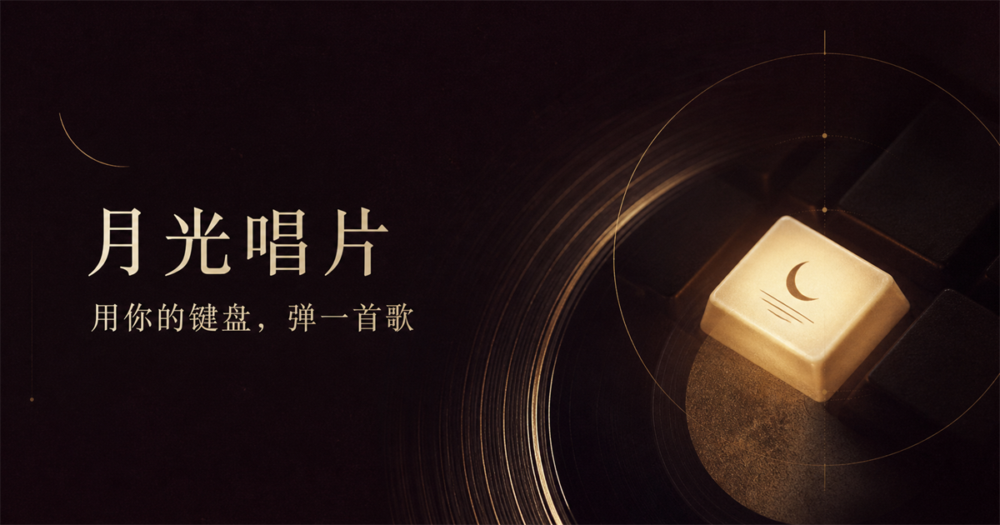
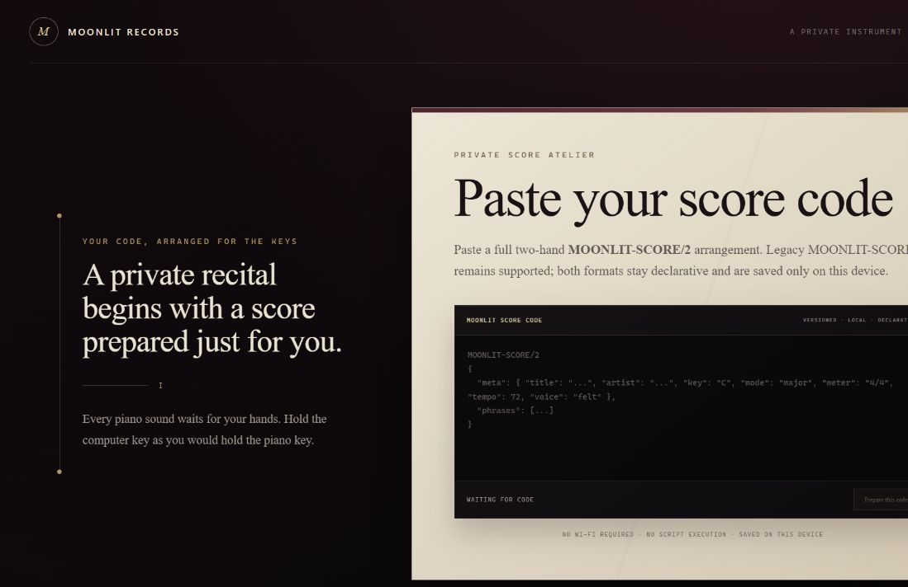
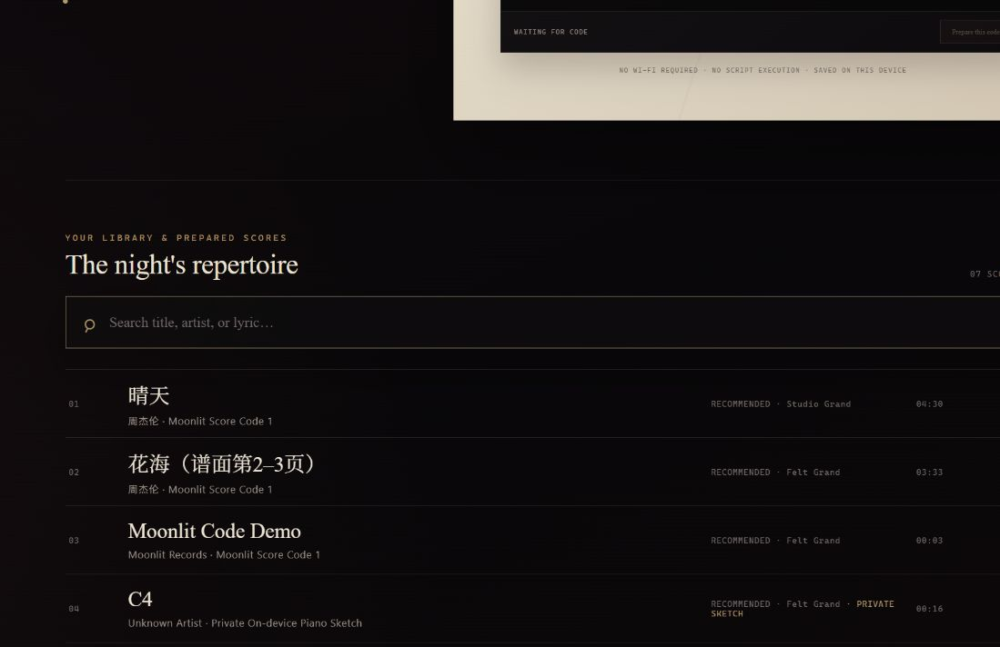
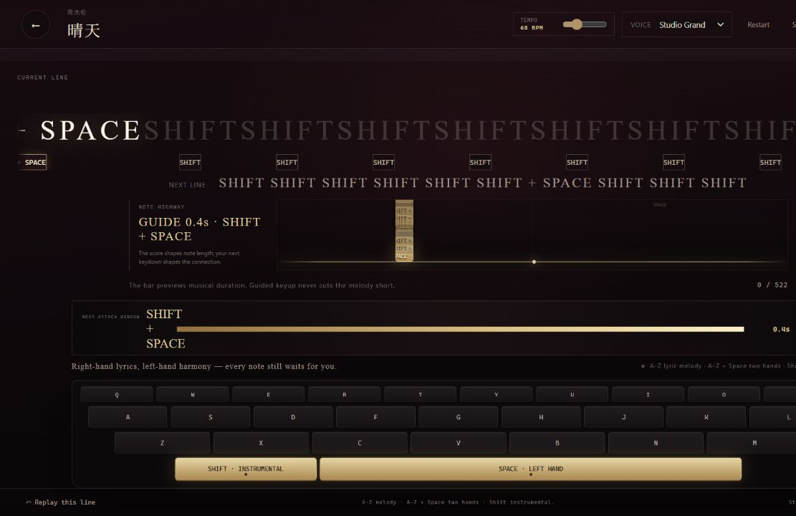
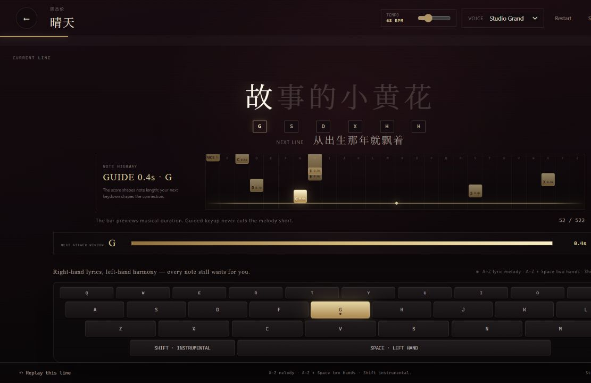
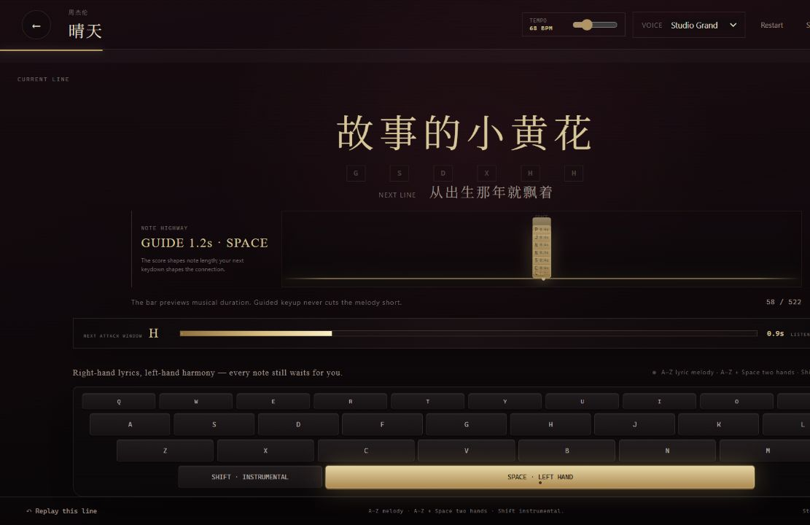

<div align="center">



# 🌙 Moonlit Records

### ⌨️ Type the lyric. 🎼 Conduct the hands. 🎹 Hear the piano.

An expressive, lyric-guided concert piano for the keyboard you already own.

[](https://github.com/IAMFanxy13/moonlit-records/actions/workflows/ci.yml)


</div>

---

Moonlit Records turns ordinary typing gestures into a full, two-hand piano performance. You decide **when every musical event begins**. The score and piano engine decide how that event should breathe: melody, octave colour, bass, harmony, voicing, release, overlap, and room tail.

There is no autoplay hiding behind the interface. Every note still waits for you.

## 🖼️✨ Interface preview

<div align="center">

### 🎼 From score code to a private recital



<br><br>

<table>
  <tr>
    <td width="50%" align="center">
      
      <br><strong>📚 The night's repertoire</strong>
      <br><sub>Local songs, prepared scores, piano voice suggestions, and search.</sub>
    </td>
    <td width="50%" align="center">
      
      <br><strong>🎹 The performance stage</strong>
      <br><sub>Note highway, shared duration guide, voice selector, and the full keyboard.</sub>
    </td>
  </tr>
  <tr>
    <td width="50%" align="center">
      
      <br><strong>🔤 Lyrics become playable gestures</strong>
      <br><sub>One centred lyric line, visible initials, and the next phrase in view.</sub>
    </td>
    <td width="50%" align="center">
      
      <br><strong>🌌 Left-hand Space, exactly where it belongs</strong>
      <br><sub>A distinct bass-and-harmony cue with its own musical duration.</sub>
    </td>
  </tr>
</table>

#### 🌙 Dark velvet · 🥂 warm gold · 🎻 concert-room restraint · ✨ zero visual noise

</div>

## ✨ The idea

Most virtual pianos ask beginners to think like pianists before they can sound musical. Moonlit Records starts somewhere more familiar: language.

```text
lyrics        你      好          久
right hand    N      H           J
left hand        SPACE      SPACE
```

The visible lyric becomes the score. Pinyin initials or English word initials guide the right hand; score-positioned `Space` cues bring in the left. A single computer key may trigger a carefully voiced piano gesture, but it never triggers the next musical event automatically.

## 🎛️ One simple keyboard, three musical roles

| Input | Musical role | What the score may produce |
| --- | --- | --- |
| 🔤 `A–Z` | Lyric-led right hand | Melody, octave colour, or an explicit written voicing |
| 🌌 `Space` | Left hand | Bass, open fifths, octaves, and harmony |
| 🎶 `Shift` | Lyric-free right hand | Introductions, fills, and instrumental passages |

- 🎵 Wrong letters still sound as free piano notes, but never move the song forward.
- 🤝 A simultaneous two-hand moment clearly asks for `LETTER + SPACE`.
- ⭐ A Space between two lyric characters appears as its own cue and never masquerades as a chord.
- 🔘 One lyric token with several melody notes stays visually singular and uses progress dots instead of duplicated words.
- 👆 Browser key repeat is ignored; every attack requires a fresh physical keydown.

## 🎹 Why it feels different

### 👆 You control the attack

A correct `keydown` begins the musical gesture immediately. The next event opens as soon as every required hand part has arrived; it never waits for `keyup`.

### 🎼 The score shapes the release

Beginners do not need to release every key with concert-pianist precision. Guided notes use their printed duration, the next real attack, rests, phrase boundaries, and same-note retriggers to find a musical release. The system will not hard-cut an early keyup, and it will not sustain forever while waiting for the next note.

### 🌊 Voices may overlap

Physical keys own independent audio handles. One hand can release without silencing the other, adjacent melody notes can form a controlled legato overlap, and true two-hand events can sound together.

### 💎 Richness without fake autoplay

Single-note guided gestures may receive a lighter octave or an open bass voicing. Explicit score chords remain authoritative. The melody stays strongest, so added colour makes the performance fuller without making the song unrecognisable.

## 🎭 The stage

- 📝 A single, centred lyric line scales to the available width.
- 🔤 Every lyric token keeps its required initial visible.
- 🔘 Multi-note lyric tokens use compact progress dots.
- ⭐ Left-hand stars can appear before the line, above a word, exactly between words, or after the line.
- ⏳ The shared duration rail is a musical preparation cue—not a `Perfect / Good / Miss` scoring system.
- 🎹 The full on-screen keyboard shows the current target, held keys, free notes, and mistakes without blocking improvisation.

## 🧾 Moonlit Score Code

The website performs declarative score data. It does not evaluate pasted JavaScript.

- `MOONLIT-SCORE/2` is the current format for exact two-hand gestures, timing, velocities, lyric ownership, articulation, harmony, and pedal intent.
- `MOONLIT-SCORE/1` remains supported and is normalised to the current internal model.
- Imported scores stay on the device and can be renamed or deleted from the repertoire.

```text
MOONLIT-SCORE/2
{
  "meta": {
    "title": "A Night in Bloom",
    "artist": "Moonlit Records",
    "key": "F",
    "mode": "major",
    "meter": "4/4",
    "tempo": 72,
    "voice": "felt"
  },
  "phrases": [
    {
      "text": "你好",
      "events": [
        {
          "beat": 0,
          "lyric": { "id": "ni", "text": "你", "subIndex": 0 },
          "right": {
            "trigger": "KeyN",
            "notes": [{ "pitch": "A4", "velocity": 0.78, "durationBeats": 1 }],
            "articulation": "legato"
          },
          "left": {
            "trigger": "Space",
            "notes": [
              { "pitch": "F2", "velocity": 0.58, "durationBeats": 2 },
              { "pitch": "C3", "velocity": 0.48, "durationBeats": 2 }
            ],
            "role": "left-open-voicing"
          }
        }
      ]
    }
  ]
}
```

Authoring references:

- [`MOONLIT-SCORE/2 authoring guide`](web/docs/moonlit-score-2-authoring-guide.md)
- [`Prompt for arranging a score with GPT`](web/docs/gpt-piano-arrangement-prompt.md)
- [`Current complete behavior reference — 中文`](web/CURRENT_LOGIC_ZH.md)

## 🔊 Piano engine

Moonlit uses local Salamander Grand Piano samples through Tone.js, with separate stages for attack, source release, phrase resonance, tonal filtering, room reverb, and completion tail.

Four performance profiles are available across the entire instrument:

| Voice | Character |
| --- | --- |
| 🕯️ **Felt Grand** | Intimate, soft-edged, lyrical |
| 🏛️ **Concert Grand** | Open, resonant, hall-sized |
| 🎙️ **Studio Grand** | Clear, articulate, close |
| 📻 **Vintage Upright** | Dry, nostalgic, characterful |

Pause, restart, replay, page hide, and window blur release every active handle, preventing stuck notes.

## 🧠 Architecture

```text
physical keydown
      │
      ├── free / wrong key ──► stable keyboard note ──► physical keyup release
      │
      └── guided input ──────► score event + hand parts
                                      │
                         ┌────────────┴────────────┐
                         ▼                         ▼
                    right gesture             left gesture
                         └────────────┬────────────┘
                                      ▼
                          independent audio handles
                                      │
                         target duration + next attack
                         + rest + phrase boundary
                                      │
                                      ▼
                         natural release and room tail
```

Key implementation areas:

- `web/app/components/PlayerShell.tsx` — physical input, score cursor, audio handles, and cleanup.
- `web/app/lib/player-machine.ts` — correct/wrong input and multi-part advancement.
- `web/app/components/LyricStage.tsx` — lyric initials, progress dots, and Space stars.
- `web/app/import/moonlit-score-v2.ts` — strict Score/2 validation and compilation.
- `web/app/audio/piano-engine.ts` — sample playback, polyphony, and voice channels.
- `web/app/lib/piano-performance.ts` — target duration and musical release planning.

## 🚀 Run locally

Requires Node.js `22.13` or newer.

```bash
git clone https://github.com/IAMFanxy13/moonlit-records.git
cd moonlit-records/web
npm ci
npm run dev
```

Open [http://localhost:3000](http://localhost:3000).

## ✅ Verification

```bash
cd web
npm test
npx tsc --noEmit
npm run lint
npm run build
npm run test:render
npm audit --omit=dev --audit-level=high
```

GitHub Actions runs the web suite and the lightweight Python processor contract tests on every push and pull request.

## 🗂️ Repository map

```text
moonlit-records/
├── web/         React 19 · TypeScript · Tone.js · Vinext
├── processor/   optional local-analysis contract scaffold
└── docs/        product and engineering design history
```

## 🔐 Privacy and rights

The core performance workflow is local-first and needs no paid service, subscription, or account. The compact Salamander Grand Piano sample set is used under CC BY 3.0; full attribution is in [`web/public/audio/ATTRIBUTION.md`](web/public/audio/ATTRIBUTION.md).

No general software licence has been selected for this repository yet. Until one is added, normal copyright restrictions apply to the source code.

---

<div align="center">

🌙 **Moonlit Records**<br>
*A free piano, with language as the score and your timing as the performance.* 🎹

</div>
